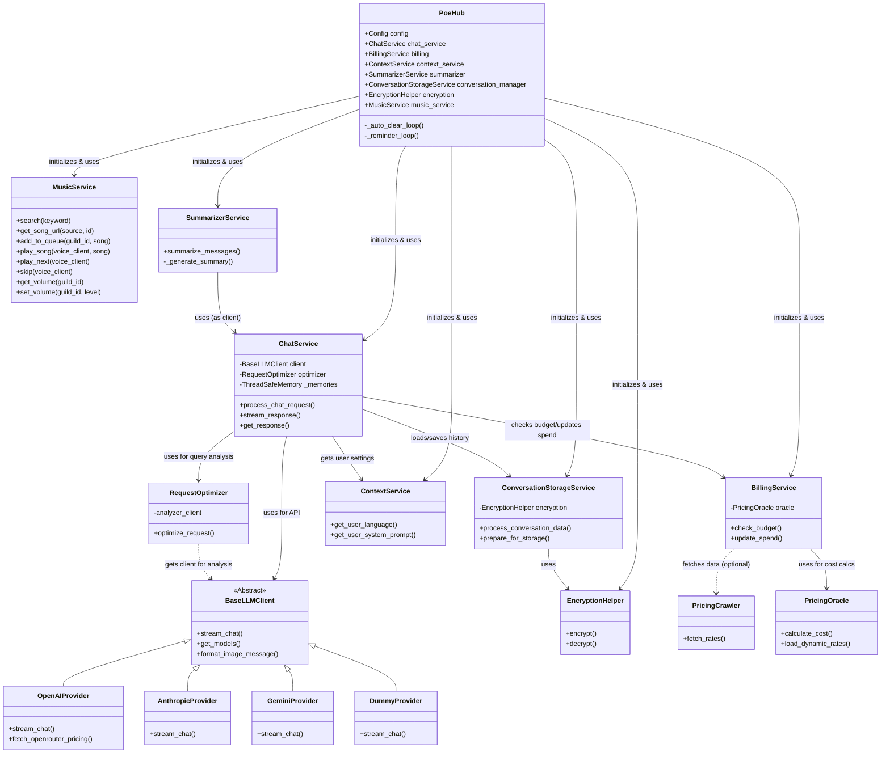

# PoeHub Project Structure & Class Interactions

This document visualizes the high-level architecture of the PoeHub project, showing how the main Red-DiscordBot Cog (`PoeHub`) interacts with various services and the API client layer.

## Class Interaction Graph

## Component Overview

### Core
*   **PoeHub**: The central Cog that integrates with Red-DiscordBot. It handles commands (slash & text), events, and background loops (auto-clear, reminders). It initializes and coordinates all other services.

### Service Layer
*   **ChatService**: The heart of the bot. It orchestrates the flow from receiving a Discord message -> checking billing -> loading context -> optimizing request -> streaming from API -> updating Discord message.
*   **BillingService**: Manages quotas, budgets, and tracks spending per user/guild. It relies on `PricingOracle` for cost calculations.
*   **ContextService**: Abstraction for retrieving user and guild configuration (system prompts, languages, active conversation IDs).
*   **SummarizerService**: Provides map-reduce style summarization for long conversation histories, leveraging the `ChatService` to generate summaries.
*   **RequestOptimizer**: Analyzes user queries (using a lightweight model) to dynamically adjust parameters like `web_search`, `thinking_level`, etc.
*   **ConversationStorageService**: Handles the secure storage (encryption/decryption) of conversation history in the bot's config.
*   **MusicService**: Manages music search (via TuneFree API), audio playback, playlist queue, and volume control for voice channels.

### Infrastructure / API
*   **BaseLLMClient**: Abstract interface for different AI providers.
*   **OpenAIProvider**: Implementation for OpenAI-compatible APIs (including Poe, DeepSeek, OpenRouter).
*   **EncryptionHelper**: Handles Fernet encryption for data at rest.
